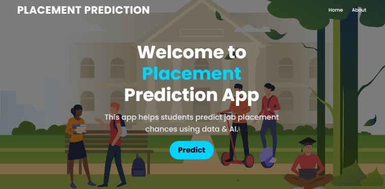
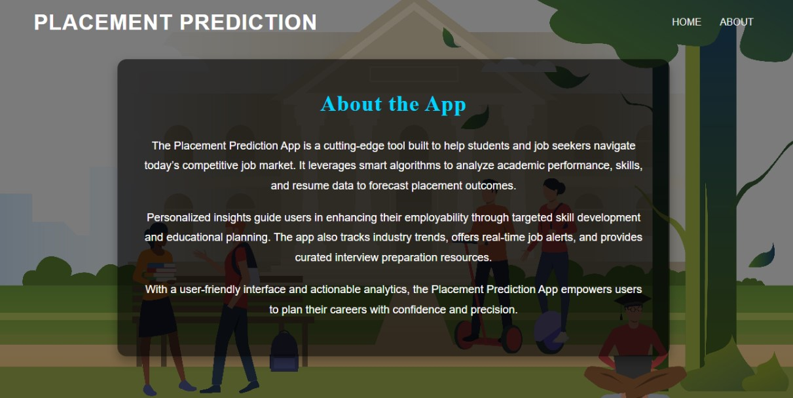
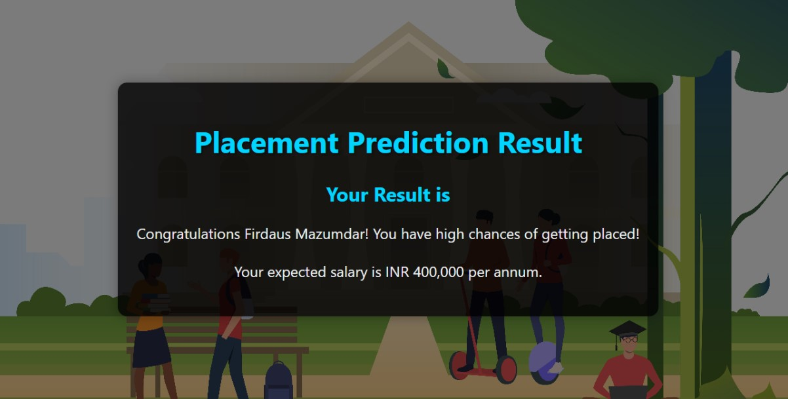
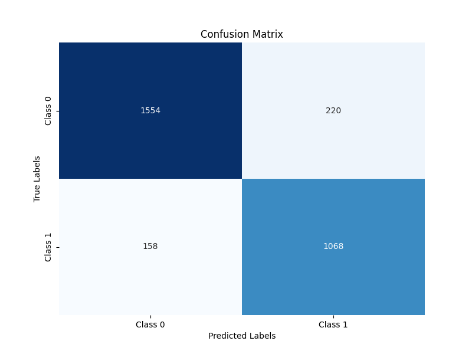
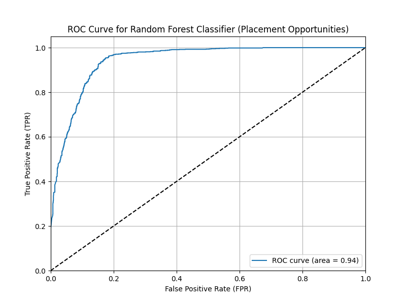
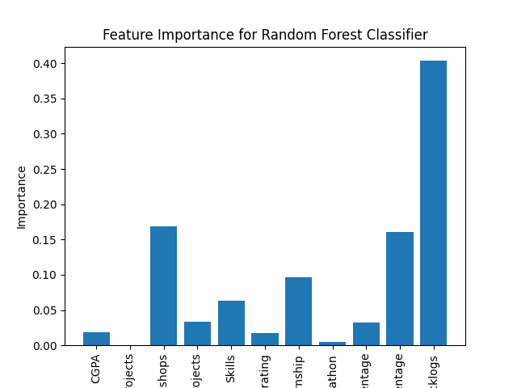

# Placement Prediction using Machine Learning

This project predicts whether a student is likely to be placed and estimates their potential salary using machine learning models. It is designed to help students and educational institutions assess placement readiness and improve outcomes using data-driven insights.

## 🔍 Final Result





---

## 📌 Table of Contents

- [Overview](#overview)
- [Dataset](#dataset)
- [Installation](#installation)
- [Project Structure](#project-structure)
- [Data Preprocessing](#data-preprocessing)
- [Model Training](#model-training)
- [Evaluation](#evaluation)
- [Results](#results)
- [Flask App](#flask-app)


---

## 📘 Overview

Campus placement is one of the most important phases for students. By analyzing a student's academic and extracurricular background, we can predict their placement chances and estimated salary using machine learning. The project includes both model training and deployment through a Flask-based web app.

---

## 📊 Dataset

The dataset includes the following features:
- Academic metrics (CGPA, percentage scores)
- Number of projects and mini-projects
- Technical skills (counted from a comma-separated list)
- Communication skills
- Internships and hackathons
- Number of backlogs
- Placement status and salary (for supervised training)

Separate datasets were used for:
- **Placement prediction**
- **Salary prediction**

---

## 🛠️ Installation

To run this project locally:

1. **Clone the repository**:
   ```bash
   git clone https://github.com/charans2702/Placement_Prediction_Using_Machine-Learning.git
   cd Placement_Prediction_Using_Machine-Learning
````

2. **Install required packages**:

   ```bash
   pip install -r requirements.txt
   ```

3. **Run the Flask app**:

   ```bash
   python app.py
   ```

---

## 📁 Project Structure

```
Placement_Prediction_Using_Machine-Learning/
│
├── static/                     # Static assets (images, CSS)
│   └── images/
├── templates/                  # HTML templates
│   ├── home.html
│   ├── about.html
│   ├── index.html
│   └── out.html                ✅ Required for displaying results
│
├── app.py                      # Flask application
├── model.pkl                   # Placement prediction model
├── model1.pkl                  # Salary prediction model
├── Placement_prediction_data.csv
├── Placement_prediction.py     # Model training script for placement
├── salary_prediction_data.csv
├── salary_prediction.py        # Model training script for salary
├── preprocessing.ipynb         # Data cleaning and preparation
├── requirements.txt
└── README.md
```

---

## ⚙️ Data Preprocessing

The preprocessing includes:

* Handling missing/null values
* Label encoding or one-hot encoding of categorical fields
* Normalizing numerical features (if needed)
* Converting comma-separated skills into a count value

---

## 🤖 Model Training

Two models were trained using Random Forest Classifiers:

1. **Placement Prediction Model** – Classifies students as `Placed` or `Not Placed`.
2. **Salary Prediction Model** – Regresses the estimated salary based on student metrics and placement status.

Steps:

* Train-test split
* Model training
* Hyperparameter tuning
* Saving models using `pickle`

---

## 📈 Evaluation

Metrics used for placement classification:

* Accuracy: **88.7%**
* Precision: **0.93**
* Recall: **0.86**
* F1 Score: **0.90**
* ROC AUC Score: **0.94**

### 📊 Confusion Matrix



### 📊 ROC Curve



### 📊 Feature Importance



---

## 🌐 Flask App

The web app provides:

* A clean UI to enter student details
* Placement prediction
* Salary estimation (if placed)
* User-friendly results shown on `out.html`

You can access different pages:

* `/` → Home
* `/index` → Form input page
* `/about` → About the project
* `/predict` → Trigger model predictions

---

## 🤝 Contributing

Feel free to fork this repository and submit pull requests or open issues for improvements, bug fixes, or feature requests.
